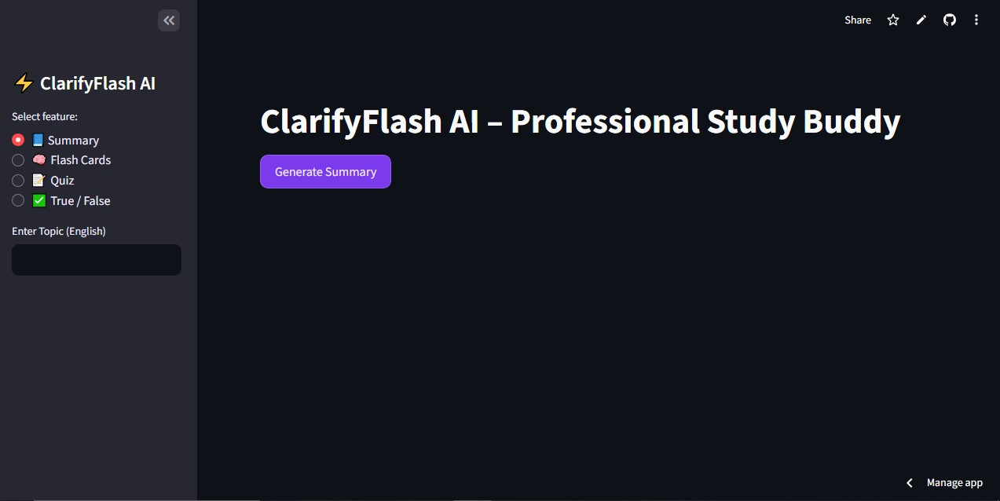
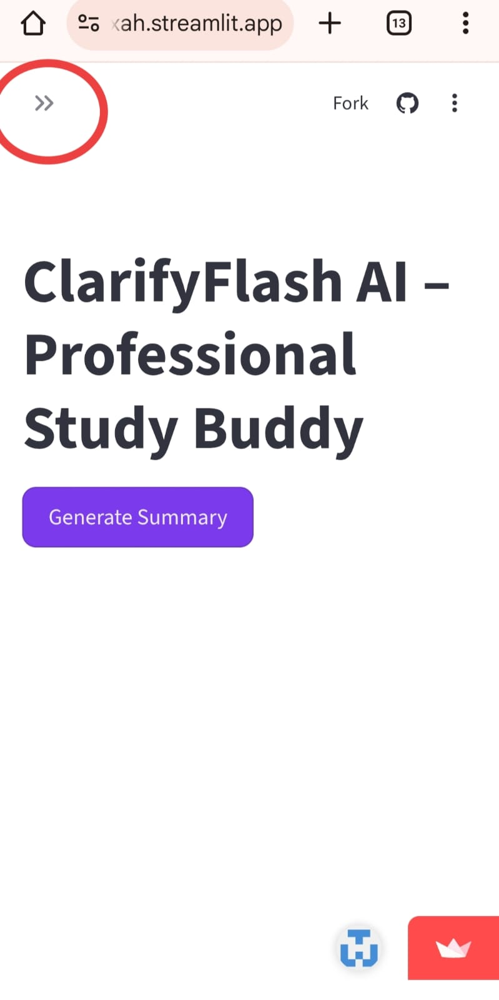
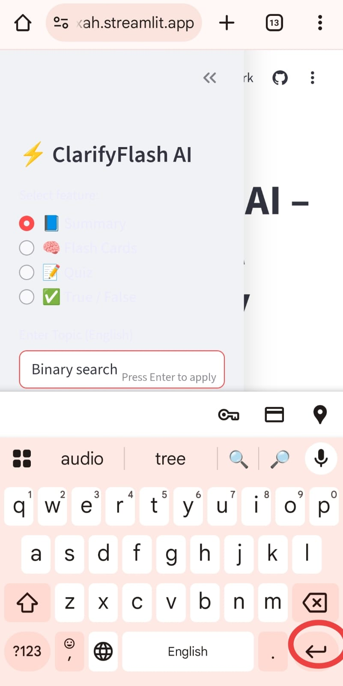

# ClarifyFlash AI ⚡

ClarifyFlash AI is an AI-powered study assistant built using Streamlit and Hugging Face.

## Features
- Topic summary in simple English
- Flash cards for quick revision
- MCQ quiz with score calculation
- True/False quiz with scoring
- Downloadable questions and answers

## Tech Stack
- Python
- Streamlit
- Hugging Face API

## Live App
Deployed on Streamlit Cloud.

## How to Run Locally
1. Install dependencies  
   pip install -r requirements.txt
2. Run the app  
   streamlit run app.py
   
   ## Desktop Usage Guide 💻

On desktop devices, the sidebar is visible by default.

### Step 1: Select Feature
Choose the required feature from the sidebar (Summary, Flash Cards, Quiz, or True/False).

### Step 2: Enter Topic
Type the topic name in the **Enter Topic (English)** input box.

### Step 3: Apply Topic
After typing the topic, press the **Enter** key on the keyboard to apply the topic and generate results.

   
   ## Mobile Usage Guide 📱

On mobile devices, the sidebar is hidden by default to keep the interface clean.

### Step 1: Open Sidebar
Tap the `<<` icon at the top-left corner to open the sidebar.

### Step 2: Enter Topic
Once the sidebar is open:
- Select the feature (Summary / Flash Cards / Quiz / True/False)
- Enter the topic in the input box
- Press the **Enter** key on the mobile keyboard to apply

> Note: On mobile devices, pressing the Enter key on the keyboard is required to submit the topic.

## Recommended Usage ⭐

For the best experience, it is recommended to use **ClarifyFlash AI on a desktop or laptop**.

- The sidebar is fully visible on desktop, making navigation easier.
- Topic input and feature selection are more convenient using a physical keyboard.
- Pressing the **Enter** key to apply topics works smoothly on desktop.

While the app is fully functional on mobile devices, the desktop view provides a clearer layout and a more comfortable learning experience.

